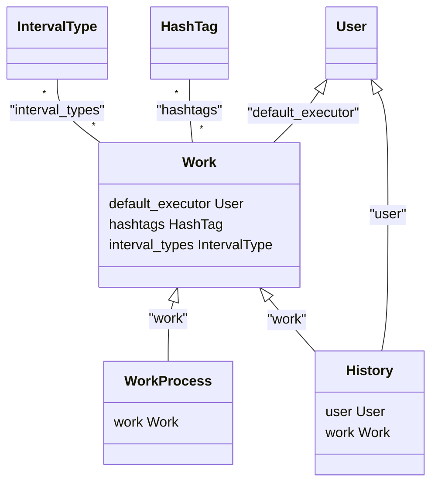

# Manage Task App

- タスクを管理するアプリケーションです
- 機能
  - タスクの追加
  - タスクのプロセスの追加
  - タスクの実行履歴の追加

## Structure

※This section is created by chat-gpt 4.

### Models Overview

This documentation provides a detailed look at the models defined in the Django application.

#### HashTag Model

- **Fields**:
  - `name`: CharField(max_length=50) - Stores the name of the hashtag.
  - `description`: CharField(max_length=200) - Provides a description of the hashtag.
  - `pub_date`: DateTimeField(auto_now_add=True) - Automatically set to the time when the hashtag is created.
  - `update_date`: DateTimeField(auto_now=True) - Automatically updated each time the hashtag record is saved.
- **Description**: This model represents hashtags that can be tagged to other objects within the database. It includes timestamps to track the creation and updates over time.

#### Work Model

- **Fields**: (incomplete in snippet)
  - `name`: CharField - The name of the work.
  - Additional fields were not visible in the provided code snippet.
- **Description**: Likely used to represent tasks or projects within the system. Additional details would be required for a complete description.

### Additional Definitions

#### WEEKDAY_CHOICES

A list of tuples mapping integers to day names in Japanese, potentially used to represent days of the week in other models.

#### PRIORITY_CHOICES

A list of tuples defining priority levels for tasks or entries in the database such as urgent, soon, or whenever convenient.

### Relation

- [models.py](./mysite/houseworks/models.py)



### Controller


#### IndexView

**Base class:** ListView
**Description:**
View for index '/'

#### WorkDetailView

**Base class:** DetailView
**Description:**

```python
model = Work
queryset = Work.objects.prefetch_related(
    "hashtags",
    "interval_types",
)

def get_context_data(self, **kwargs):
    context = super().get_context_data(**kwargs)
    context["work_processes"] = WorkProcess.objects.filter(work=self.object)
    return context
```

class WorkCreateView(CreateView):

#### HistoryDetailView

**Base class:** DetailView
**Description:**
View for detail '/specifics/<int:pk>'

## Deployment
